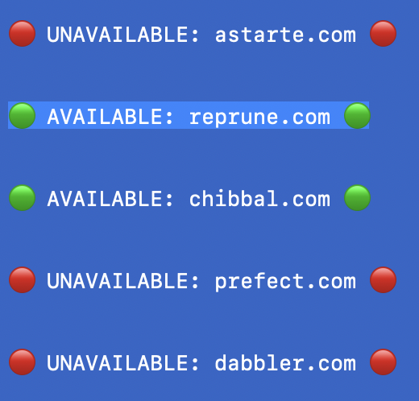

# FindDomains

A tool for finding available .com domain names based on English words of a specified length.



## Overview

This script checks the availability of domain names by:
1. Taking English words of a specified length
2. Checking if they're available as .com domains using RDAP protocol
3. Outputting results to console and a text file

## Installation

```bash
# Clone the repository
git clone https://github.com/yourusername/FindDomains.git
cd FindDomains

# Install dependencies
pip install tqdm english_words
```

## Usage

Run the script with Python:

```bash
python FindNames.py
```

By default, it checks 6-letter words. To change this, edit the `word_length` variable in the script.

The script will:
- Display progress with a progress bar
- Print available domains in real-time
- Create a file `available_domains.txt` with the results

## Features

- Multi-threaded domain checking for faster results
- Checks against actual domain registration data
- Progress bar showing completion status
- Results saved to file for future reference

## Limitations

- Be mindful of RDAP rate limits - sending too many requests may get your IP temporarily blocked
- Use responsibly and in accordance with RDAP service terms
- Performance depends on your internet connection and the RDAP server's response time

## License

[MIT License](LICENSE) 